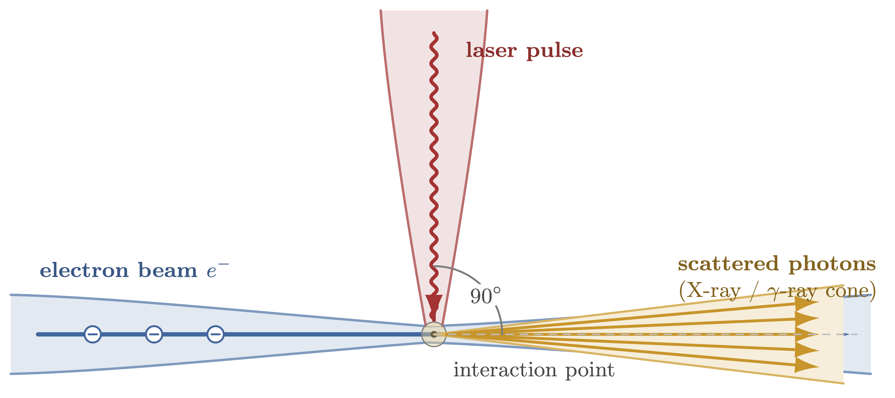
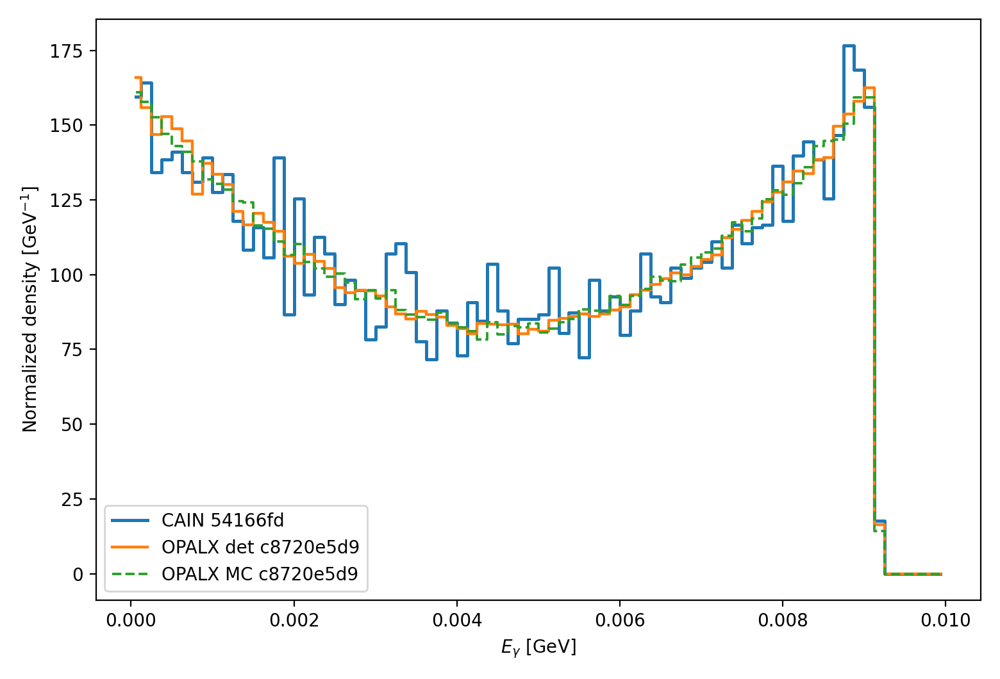
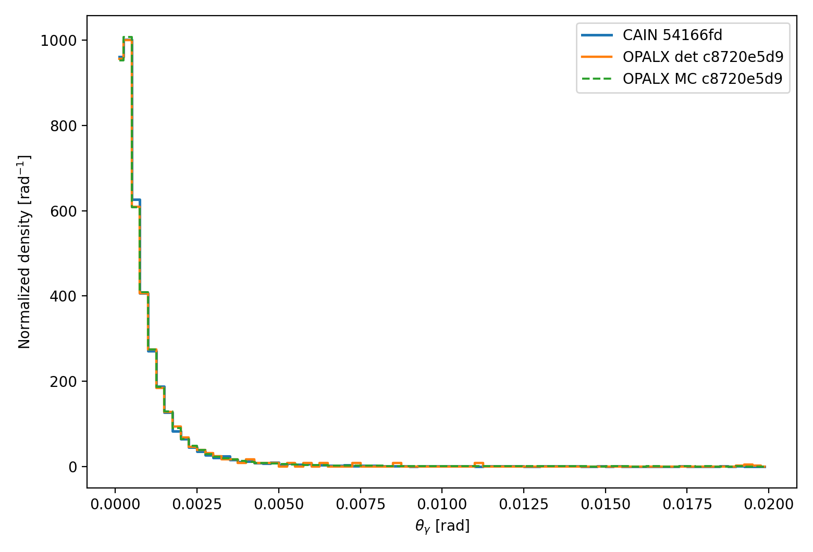
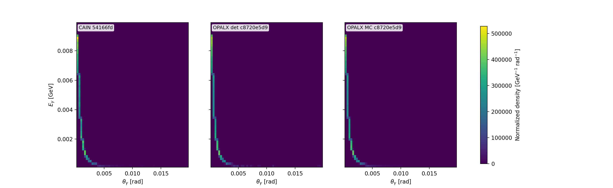
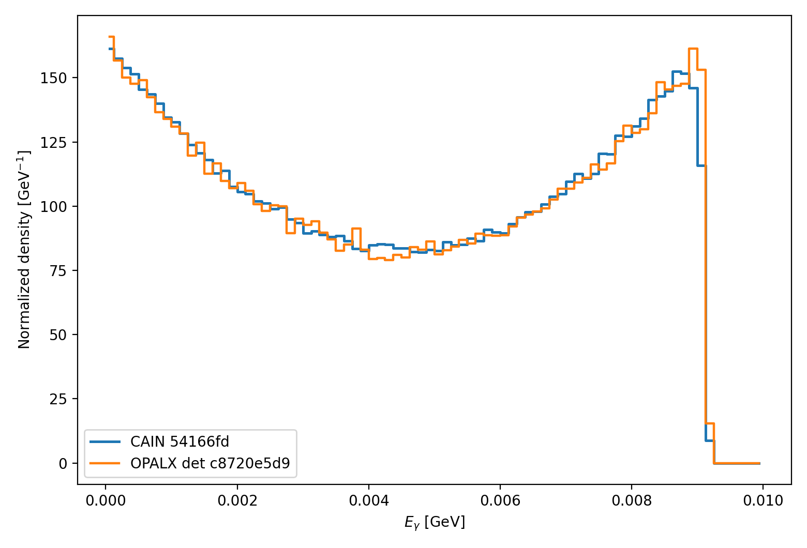
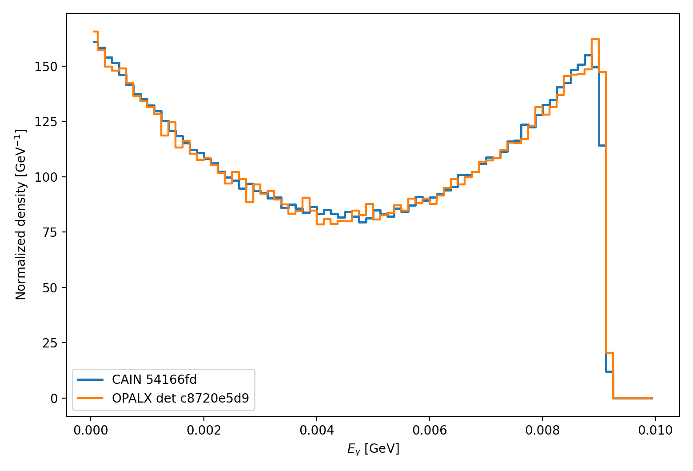
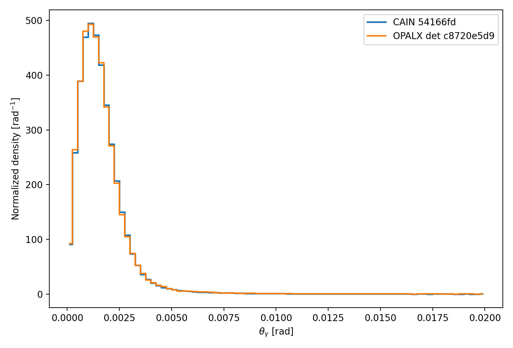
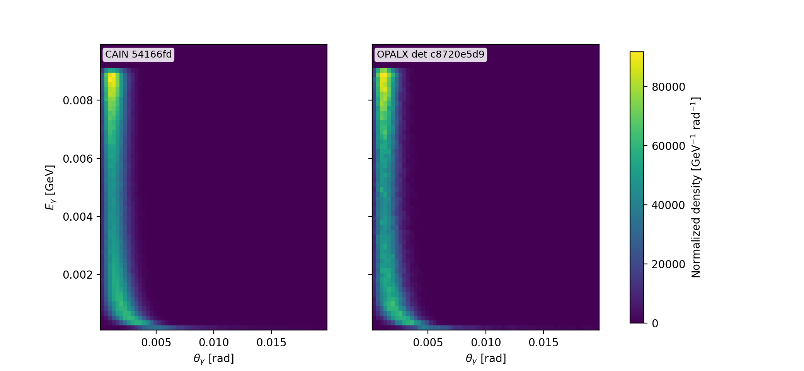
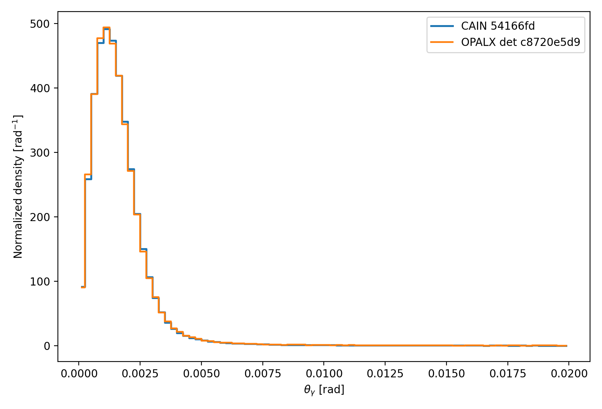

= Linear Compton Benchmark
:toc:
:toclevels: 3
:sectnums:
:stem: latexmath
:eqnums:
:docinfo: shared

== Scope

This note documents the current _OPALX_ validation path for linear inverse
Compton scattering in the weak-field regime. The immediate goal is not yet a
full tracking implementation, but a CAIN-validated benchmark path for the
process

[latexmath]
++++
e^- + \gamma_L \rightarrow e^- + \gamma .
++++

The benchmark follows the same staged strategy as the Breit-Wheeler note:

- start from a fixed-geometry, unpolarized, linear process,
- validate deterministic and sampled spectra against CAIN,
- then extend to broader beam models without enabling tracked interaction yet.

The baseline geometry used here is a latexmath:[90^\circ] crossing between a
`1 GeV` electron beam along latexmath:[\hat z] and a laser photon beam along
latexmath:[\hat x] with wavelength `1030 nm`.

== Physics Models

=== Basic Kinematics

For a laser wavelength latexmath:[\lambda_L], the photon energy is

[latexmath]
++++
\omega_L = \frac{2 \pi \hbar c}{\lambda_L} .
\label{eq:ics-laser-energy}
++++

For an electron with total energy latexmath:[E_e] and momentum magnitude
latexmath:[p_e = \sqrt{E_e^2 - m_e^2}], the exact forward-scattered photon
energy in the `90 degree` benchmark geometry is

[latexmath]
++++
\omega_\gamma' =
\frac{E_e \, \omega_L}
     {\omega_L + \frac{m_e^2}{E_e + p_e}} .
\label{eq:ics-forward-energy}
++++

The current OPALX helper uses this numerically stable form directly in the unit
benchmark.

=== Rest-Frame Model

The exact linear Compton kernel is evaluated in the electron rest frame. Let
latexmath:[\omega_1] be the incoming photon energy there and let
latexmath:[\Theta^*] be the photon scattering angle. The scattered photon energy
is

[latexmath]
++++
\omega_2(\Theta^*) =
\frac{\omega_1}
     {1 + (\omega_1/m_e)(1 - \cos \Theta^*)} .
\label{eq:ics-erf-energy}
++++

The unpolarized Klein-Nishina differential cross section is

[latexmath]
++++
\frac{d\sigma}{d\Omega^*}
= \frac{r_e^2}{2}
  \left(\frac{\omega_2}{\omega_1}\right)^2
  \left(
    \frac{\omega_1}{\omega_2}
    +
    \frac{\omega_2}{\omega_1}
    - \sin^2 \Theta^*
  \right) .
\label{eq:ics-klein-nishina}
++++

Changing variables from latexmath:[\cos\Theta^*] to latexmath:[\omega_2]
gives the one-dimensional energy spectrum in the rest frame,

[latexmath]
++++
\frac{d\sigma}{d\omega_2}
= 2\pi \frac{d\sigma}{d\Omega^*} \frac{m_e}{\omega_2^2} .
\label{eq:ics-dsigma-domega}
++++

with exact support
latexmath:[\omega_2 \in [\omega_1/(1+2\omega_1/m_e),\,\omega_1]].

The exact total Klein-Nishina cross section can be written with
latexmath:[\kappa = \omega_1/m_e] as

[latexmath]
++++
\sigma_{\mathrm{KN}} = 2\pi r_e^2
\left[
  \frac{1+\kappa}{\kappa^3}
  \left(
    \frac{2\kappa(1+\kappa)}{1+2\kappa} - \ln(1+2\kappa)
  \right)
  + \frac{\ln(1+2\kappa)}{2\kappa}
  - \frac{1+3\kappa}{(1+2\kappa)^2}
\right] .
\label{eq:ics-total-cross-section}
++++

For latexmath:[\kappa \ll 1] this approaches the Thomson limit

[latexmath]
++++
\sigma_T = \frac{8\pi}{3} r_e^2 .
\label{eq:ics-thomson}
++++

== Implemented OPALX Benchmark

The current _OPALX_ implementation is the CAIN-validated benchmark path on the
`laser-element-1` branch. The relevant code files are:

- link:https://github.com/OPALX-project/OPALX/blob/laser-element-1/src/Physics/LinearCompton.h[`src/Physics/LinearCompton.h`]
- link:https://github.com/OPALX-project/OPALX/blob/laser-element-1/src/Physics/LinearCompton.cpp[`src/Physics/LinearCompton.cpp`]
- link:https://github.com/OPALX-project/OPALX/blob/laser-element-1/unit_tests/Physics/TestLinearCompton.cpp[`unit_tests/Physics/TestLinearCompton.cpp`]
- link:https://github.com/OPALX-project/OPALX/blob/laser-element-1/unit_tests/Physics/TestLinearComptonSpectrum.cpp[`unit_tests/Physics/TestLinearComptonSpectrum.cpp`]
- link:https://github.com/OPALX-project/OPALX/blob/laser-element-1/unit_tests/Physics/LinearComptonSpectrumBenchmark.cpp[`unit_tests/Physics/LinearComptonSpectrumBenchmark.cpp`]
- `~/git/OPALX-project.github.io/gamma-gamma/generate-gamma-gamma-results.sh`
- `~/git/cain/generate-linear-compton-results.sh`
- `~/git/cain/build-cain.sh`

The benchmark remains deliberately narrow:

- no tracked `LASER` interaction,
- no photon bunch population,
- no luminosity or overlap integration beyond the benchmark setup.

The validated observables are now:

- [*] photon energy spectrum,
- [*] photon laboratory polar-angle spectrum,
- [*] joint latexmath:[E_\gamma] vs. latexmath:[\theta_{\gamma,\mathrm{lab}}] map,
- [*] finite-beam energy, angle, and joint spectra,
- [*] finite-beam plus energy-spread energy, angle, and joint spectra,
- [*] overlap-restricted finite-beam energy and angle spectra.

== Results of Code Comparison

The current CAIN-backed _OPALX_ benchmark covers weak-field linear inverse Compton scattering for:

- electron total energy `1 GeV`,
- laser wavelength `1030 nm`,
- crossing angle latexmath:[90^\circ],
- unpolarized laser `STOKES=(0,0,0)`,
- CAIN weak-field parameter latexmath:[\xi = 0.2955 < 0.3].

Single-electron benchmark agreement:

- [*] energy spectrum, deterministic: mean difference about `0.5%`, latexmath:[L_1] about `0.0767`
- [*] energy spectrum, sampled: mean difference about `0.45%`, latexmath:[L_1] about `0.0763`
- [*] lab-angle spectrum, deterministic: mean difference about `4.0%`, latexmath:[L_1] about `0.0400`
- [*] lab-angle spectrum, sampled: mean difference about `1.3%`, latexmath:[L_1] about `0.0250`
- [*] joint latexmath:[E_\gamma]--latexmath:[\theta_{\gamma,\mathrm{lab}}] map, deterministic: mean-energy difference about `0.48%`, mean-angle difference about `4.03%`, latexmath:[L_1] about `0.0849`
- [*] joint latexmath:[E_\gamma]--latexmath:[\theta_{\gamma,\mathrm{lab}}] map, sampled: mean-energy difference about `0.44%`, mean-angle difference about `1.21%`, latexmath:[L_1] about `0.0709`

Finite-beam benchmark agreement:

- [*] baseline finite beam (`sigma_x = sigma_y = 1 mm`, `sigma_{x'} = sigma_{y'} = 1 mrad`): energy mean difference about `0.58%`, latexmath:[L_1] about `0.0316`
- [*] baseline finite beam angle spectrum: mean difference about `0.21%`, latexmath:[L_1] about `0.0142`
- [*] baseline finite-beam joint latexmath:[E_\gamma]--latexmath:[\theta_{\gamma,\mathrm{lab}}] map: mean-energy difference about `0.58%`, mean-angle difference about `0.11%`, latexmath:[L_1] about `0.0741`
- [*] finite beam with relative energy spread `sigma_E / E = 1.0e-3`: energy mean difference about `0.57%`, latexmath:[L_1] about `0.0305`
- [*] finite beam with relative energy spread `sigma_E / E = 1.0e-3` angle spectrum: mean difference about `0.17%`, latexmath:[L_1] about `0.0157`
- [*] finite beam with relative energy spread `sigma_E / E = 1.0e-3` joint latexmath:[E_\gamma]--latexmath:[\theta_{\gamma,\mathrm{lab}}] map: mean-energy difference about `0.57%`, mean-angle difference about `0.14%`, latexmath:[L_1] about `0.0686`
- [*] overlap-restricted finite-beam energy spectrum: mean difference about `0.71%`, latexmath:[L_1] about `0.0289`
- [*] overlap-restricted finite-beam angle spectrum: mean difference about `0.084%`, latexmath:[L_1] about `0.0135`

Single-electron overlays:

.Weak-field 90-degree linear-Compton photon energy spectrum. The figure compares the CAIN reference, the OPALX deterministic benchmark, and the OPALX Monte Carlo benchmark for pass:[Ee] = 1 GeV, pass:[&lambda;L] = 1030 nm, and pass:[&xi;] = 0.2955.

.Weak-field 90-degree linear-Compton photon laboratory polar-angle spectrum. The figure compares the CAIN reference, the OPALX deterministic benchmark, and the OPALX Monte Carlo benchmark on the common angular histogram grid.

.Weak-field 90-degree linear-Compton joint photon spectrum. The panels show the CAIN reference, the OPALX deterministic benchmark, and the OPALX Monte Carlo pass:[E&gamma;] versus pass:[&theta;&gamma;,lab] density on the common 2D grid.

Finite-beam overlays:

.Finite-beam linear-Compton photon energy spectrum for the benchmark beam with pass:[&sigma;x] = pass:[&sigma;y] = 1 mm and pass:[&sigma;x'] = pass:[&sigma;y'] = 1 mrad. The figure compares CAIN and the OPALX Monte Carlo benchmark.

.Finite-beam linear-Compton photon laboratory polar-angle spectrum for the same benchmark beam. The figure compares CAIN and the OPALX Monte Carlo benchmark on the common angular histogram grid.

.Finite-beam linear-Compton photon energy spectrum with additional electron-beam relative energy spread pass:[&sigma;E/E] = 1e-3. The figure compares CAIN and the OPALX Monte Carlo benchmark.

.Finite-beam linear-Compton photon laboratory polar-angle spectrum with additional electron-beam relative energy spread pass:[&sigma;E/E] = 1e-3. The figure compares CAIN and the OPALX Monte Carlo benchmark.

.Finite-beam joint linear-Compton photon spectrum for the benchmark beam with pass:[&sigma;x] = pass:[&sigma;y] = 1 mm and pass:[&sigma;x'] = pass:[&sigma;y'] = 1 mrad. The panels compare the CAIN reference and the OPALX Monte Carlo pass:[E&gamma;] versus pass:[&theta;&gamma;,lab] density on the common 2D grid.

.Finite-beam joint linear-Compton photon spectrum with additional electron-beam relative energy spread pass:[&sigma;E/E] = 1e-3. The panels compare the CAIN reference and the OPALX Monte Carlo pass:[E&gamma;] versus pass:[&theta;&gamma;,lab] density on the common 2D grid.

.Overlap-restricted finite-beam linear-Compton photon energy spectrum. The benchmark keeps the same finite beam and conditions the interaction on the beam-laser overlap through the benchmark Rayleigh and pulse-length scales. The figure compares CAIN and the OPALX Monte Carlo benchmark.

.Overlap-restricted finite-beam linear-Compton photon laboratory polar-angle spectrum for the same overlap-conditioned benchmark. The figure compares CAIN and the OPALX Monte Carlo benchmark on the common angular histogram grid.

== Build and Run

The CAIN build helper is now shared across the gamma-gamma notes in the common
workspace `~/git/cain`.

From `~/git/cain`:

[source,bash]
----
./build-cain.sh --download
./build-cain.sh --compile
----

The preferred one-shot workflow is run from the docs tree:

[source,bash]
----
cd ~/git/OPALX-project.github.io/gamma-gamma
./generate-gamma-gamma-results.sh --opalx-build /path/to/opalx-laser/build_openmp
----

This top-level driver:

- builds the OPALX gamma-gamma benchmark targets,
- runs the inverse-Compton and Breit-Wheeler unit/regression suites,
- regenerates the CAIN and OPALX benchmark data for both notes,
- republishes the comparison figures, and
- renders the gamma-gamma note pages.

If only the linear-Compton assets need to be refreshed, use:

[source,bash]
----
cd ~/git/cain
./generate-linear-compton-results.sh --opalx-build /path/to/opalx-laser/build_openmp
----

This script:

- runs the CAIN decks `~/git/cain/cain-linear-compton-90deg.i`, `~/git/cain/cain-linear-compton-90deg-finite-beam.i`, `~/git/cain/cain-linear-compton-90deg-finite-beam-energy-spread.i`, and `~/git/cain/cain-linear-compton-90deg-finite-beam-overlap.i`,
- regenerates the stored CAIN histogram references in `reference-data/`,
- runs the OPALX benchmark executable `LinearComptonSpectrumBenchmark`,
- regenerates the published 1D and 2D comparison plots in `reference-data/`.

The script expects:

- a built OPALX benchmark executable in the supplied build directory,
- a CAIN executable at `~/git/cain/CAIN-build/cain`, unless overridden by `--cain-bin`,
- the four CAIN decks in `~/git/cain`, unless overridden by `--cain-deck-dir`.

The relevant OPALX build target is:

[source,bash]
----
cmake --build /path/to/opalx-laser/build_openmp \
  --target LinearComptonSpectrumBenchmark TestLinearCompton TestLinearComptonSpectrum -j4
----

== References

- CAIN linear Compton generator:
  https://github.com/cfruhling2/CAIN/blob/main/src/lncpgn.f[`src/lncpgn.f`]
- CAIN laser geometry helper:
  https://github.com/cfruhling2/CAIN/blob/main/src/lsrgeo.f[`src/lsrgeo.f`]
- CAIN manual:
  https://manualzilla.com/doc/5656761/user-s-manual-of-cain[User's Manual of CAIN]

[appendix]
== CAIN Mapping

CAIN evaluates the linear Compton kinematics by boosting the laser photon into
the electron rest frame, applying the recoil there, and boosting the scattered
photon back to the laboratory frame. In CAIN's `LNCPGN`, the incoming photon
energy in the electron rest frame is

[latexmath]
++++
\omega_1 = \gamma \, \omega_L \, (1 - \beta \cos \alpha) .
\label{eq:ics-cain-w1}
++++

For the present benchmark latexmath:[\cos\alpha = 0], so

[latexmath]
++++
\omega_1 = \gamma \, \omega_L .
\label{eq:ics-cain-w1-90deg}
++++

This is the CAIN mapping reproduced by the current OPALX helper and benchmark
path.
